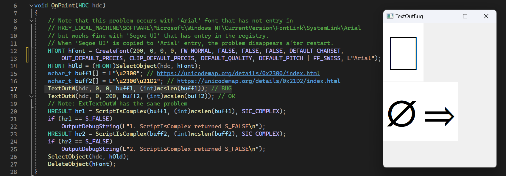

# TextOutBug

The example shows an error in WinAPI TextOut and ExtTextOut. If the 'Arial' font is selected in Windows 11
and the character '⌀' is displayed, a rectangle is displayed instead of the character. If the font is, for
example 'Segoe UI', the character is displayed correctly.

